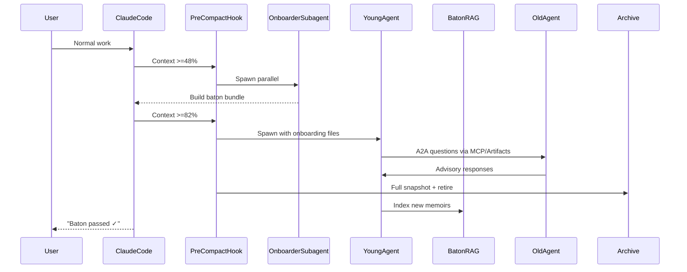

# Claude_Baton Architecture

**Version:** 1.0.0 (March 2026)  
**Status:** MVP (native Claude Code plugin — Option 1)  
**Future:** Universal orchestrator (Option 2 — LangGraph/CrewAI/Cursor/etc.)

Claude_Baton turns Claude Code’s context window from a hard limit into a generational relay race. It uses **only official 2026 primitives** (lifecycle hooks, subagents, Agent Teams, MCP servers, skills, and Artifacts) so the experience feels 100 % native and future-proof.

## Philosophy & Core Insight

Long-running agents don’t fail because of token limits — they fail because of **compaction loss** and lack of structured handoff.  
Claude_Baton solves this with **proactive generational turnover**:

- At 48 % context → background onboarding
- At 82 % → spawn fresh successor (isolated context)
- At 93 % → A2A advisory overlap + graceful retirement

This creates **functionally infinite context** while preserving perfect human-readable history, decision rationale, and reusable skills.

## High-Level Architecture

```mermaid
graph TD
    A[Claude Code Session] --> B{Context Gauge}
    B -->|>=48%| C[Onboarder Subagent<br/>(parallel, zero main impact)]
    B -->|>=82%| D[Young Agent Spawn<br/>(Subagent or Agent Team)]
    D --> E[A2A Overlap via Shared Artifacts + MCP]
    E --> F[Old Agent → Advisor Mode]
    F --> G[Archive Full Snapshot<br/>& Retire]
    C --> H[Baton Protocol Artifacts<br/>.baton/generations/vN/]
    H --> I[BatonRAG MCP Server<br/>(vectorized memoirs)]
    I --> J[New Generation Tools<br/>/search-past /recall-decision]
    subgraph "Claude Code Native Primitives"
        K[Hooks: PreCompact, SessionStart, SubagentStart/Stop]
        L[Agent Teams & Subagents]
        M[Skills (SKILL.md + YAML)]
        N[Artifacts + Git auto-commit]
    end
    K --> B
    L --> D
    M --> C
    N --> H
```

## Core Components

### 1. Context Monitoring & Smart Triggers (Hooks Layer)
Uses official hooks (documented at `/docs/en/hooks`):

- **PreCompact** — primary trigger (fires before any compaction, manual or auto)
- **SessionStart** (with `compact` matcher) — re-injects baton state after compaction or resume
- **SubagentStart / SubagentStop** — manages onboarding and handoff lifecycle
- **TeammateIdle / TaskCompleted** (Agent Teams) — quality gates during A2A overlap

All thresholds (`onboard: 48`, `spawn: 82`, `retire: 93`) are configurable in `.baton/config.json`.

### 2. Onboarder Skill (Background Parallel Subagent)
- Triggered via PreCompact hook
- Runs in isolated context (does **not** pollute main session)
- Produces the complete Baton Protocol bundle while the main agent continues working
- Uses prompt-cached system instructions for near-zero cost

### 3. Young Agent & A2A Overlap (Agent Teams / Subagents)
- Spawned as native subagent or full Agent Team member
- Starts with **only** the fresh `ONBOARDING.md` + vector RAG access
- Old agent demoted to read-only Advisor via role prompt
- Overlap phase uses shared Artifacts + MCP messages for clarification and validation
- Final handoff message is clean and user-visible: “Baton passed ✓ Gen N+1 active”

### 4. BatonRAG MCP Server (Persistent Memory Layer)
- Tiny bundled MCP server (official SDK)
- Automatically vectorizes every generation’s memoirs (Chroma-style embedding)
- Provides two always-available tools:
  - `/search-past`
  - `/recall-decision`
- Cold storage (`cold_storage/`) for generations older than N; never deleted, always searchable

### 5. Baton Protocol (Standardized Artifacts)
Git-tracked, versioned, human-first format inside `.baton/generations/vN/`:

- `ONBOARDING.md`
- `MEMOIRS/narrative.md` + compressed snapshot
- `DECISIONS_LOG.md`
- `SKILLS_EXTRACTED/` (mini-skills ready for marketplace)
- `TASKS_NEXT.json` + Mermaid diagrams
- Self-test questions for successor validation

Auto-committed with tags. Unused generations moved to cold storage.

### 6. Skills & Commands Layer
All user-facing commands are namespaced skills (`/baton init`, `/baton status`, `/baton tree`, `/baton publish-skill`).

## Repository Layout (MVP)

```
claude-baton/
├── plugin.json                     # Manifest (name, version, permissions)
├── hooks/
│   └── hooks.json                  # PreCompact, SessionStart, etc.
├── skills/
│   ├── BatonManager/
│   │   └── SKILL.md
│   ├── Onboarder/
│   │   └── SKILL.md
│   └── Archivist/
│       └── SKILL.md
├── mcp/
│   └── baton-rag/                  # MCP server (Go/Python/TS)
│       ├── server.go
│       └── .mcp.json
├── .baton/                         # Generated at runtime (gitignored in examples)
│   ├── config.json
│   ├── generations/
│   └── rag/
├── docs/
│   └── ARCHITECTURE.md             # ← you are here
└── README.md
```

## Data Flow (Detailed Sequence)



## Configuration & Modes

`.baton/config.json` (created by `/baton init`):

```json
{
  "thresholds": { "onboard": 48, "spawn": 82, "retire": 93 },
  "mode": "aggressive",          // aggressive | conservative | human-gated
  "rag_enabled": true,
  "auto_commit": true,
  "max_generations_kept": 20
}
```

## Security & Edge Cases (Hardened)

- All subagents run in isolated contexts (official guarantee)
- Hooks never block unless explicitly configured
- Git merge conflicts on Markdown = normal and human-resolvable
- Multi-repo / team support via shared `.baton/` + MCP
- Agent Teams compaction bug mitigation (we archive before any team lead compaction)

## Future: Option 2 Universal Orchestrator

Once Option 1 ships and gains traction, we will release `claude-baton-sdk` (Python/TS) that implements the exact same **Baton Protocol** and artifact schema on top of any framework (LangGraph, CrewAI, Cursor, Windsurf, custom API loops). The standardized artifacts and MCP server become the universal glue.

## References (Official 2026 Docs)

- Plugin system: https://code.claude.com/docs/en/plugins
- Hooks: https://code.claude.com/docs/en/hooks
- Agent Teams & Subagents: https://code.claude.com/docs/en/agent-teams
- MCP: https://modelcontextprotocol.io + https://code.claude.com/docs/en/mcp
- PreCompact & SessionStart behavior: GitHub issues #11629, #23620 (context preservation patterns)

---

**This architecture is deliberately minimal yet complete.**  
Every piece maps 1:1 to Anthropic’s shipping primitives (no custom orchestrator in MVP).  
It is designed to become the de-facto standard for any long-running Claude Code project.
