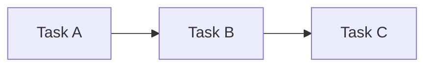
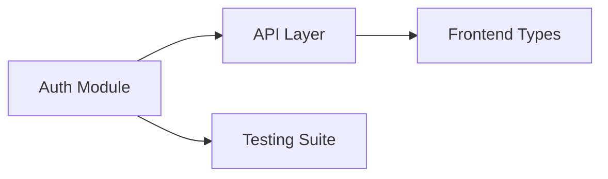

# Baton Protocol Artifact Schemas

**Version:** 1.0.0 (March 2026)
**Protocol Version:** Baton Protocol v2.0
**Compliance:** JSON Schema 2020-12 (for JSON artifacts)
**Purpose:** Comprehensive schema definitions for all Baton Protocol artifacts

---

## Overview

The Baton Protocol defines a standardized set of artifacts produced during generational handoffs in Claude_Baton. Each artifact serves a specific purpose in maintaining context continuity, decision rationale, and task progress across agent generations.

### Artifact Location Structure

```
.baton/
├── config.json                    # User configuration (persistent)
├── state.json                     # Runtime state (ephemeral)
├── generations/
│   └── v{N}/                      # Generation directory (N = integer)
│       ├── ONBOARDING.md          # Primary entry document
│       ├── MEMOIRS/
│       │   └── narrative.md       # Narrative history
│       ├── DECISIONS_LOG.md       # Decision entries
│       ├── SKILLS_EXTRACTED/
│       │   └── {skill-name}/
│       │       └── SKILL.md       # Skill definition
│       ├── TASKS_NEXT.json        # Task queue
│       └── KNOWLEDGE_GRAPH.json   # Entity relationships
└── cold_storage/                  # Archived generations
```

---

## 1. ONBOARDING.md Schema

### Purpose
Primary entry point for a new generation. Provides executive summary and quick access to all critical context needed for immediate continuation.

### Document Structure

```markdown
---
# YAML Frontmatter (Required)
schema_version: "1.0.0"
generation: string           # Format: "v{N}" (e.g., "v5")
previous_generation: string | null  # Format: "v{N}" or null for v1
created_at: string           # ISO 8601 datetime
total_runtime: string        # Format: "{hours}h {minutes}m"
handoff_reason: enum         # "context_threshold" | "manual" | "error_recovery"
context_percent: number      # 0-100, context at handoff
baton_protocol_version: string  # e.g., "2.0"
---

# Generation {generation} Onboarding

## Executive Summary
{AI-generated 2-minute read of entire project state}

## Critical Context
| Field | Value |
|-------|-------|
| Previous Gen | {previous_generation} ({duration}) |
| Total Project Runtime | {total_runtime} |
| Context Growth Rate | {growth_rate} tokens/hour |
| Handoff Reason | {handoff_reason} |

## Active Decisions
| Decision ID | Choice | Rationale | Alternatives Rejected |
|-------------|--------|-----------|----------------------|
| DEC-001 | {choice} | {rationale} | {alternatives} |

## In-Progress Tasks


## Knowledge Graph Summary
[Auto-generated from KNOWLEDGE_GRAPH.json]

## Self-Test Questions
Answer these to verify context inheritance:
1. {question_1}
2. {question_2}
3. {question_3}

## Quick Links
- Full Memoirs: `.baton/generations/{previous_generation}/MEMOIRS/`
- Decision Tree: `.baton/generations/{previous_generation}/DECISIONS_LOG.md`
- Skill Library: `.baton/generations/{previous_generation}/SKILLS_EXTRACTED/`
- Task Queue: `.baton/generations/{previous_generation}/TASKS_NEXT.json`
```

### JSON Schema for Frontmatter Validation

```json
{
  "$schema": "https://json-schema.org/draft/2020-12/schema",
  "$id": "https://claude-baton.dev/schemas/onboarding-frontmatter",
  "title": "ONBOARDING.md Frontmatter",
  "type": "object",
  "properties": {
    "schema_version": {
      "type": "string",
      "pattern": "^\\d+\\.\\d+\\.\\d+$",
      "description": "Schema version for this document"
    },
    "generation": {
      "type": "string",
      "pattern": "^v\\d+$",
      "description": "Generation identifier"
    },
    "previous_generation": {
      "oneOf": [
        { "type": "string", "pattern": "^v\\d+$" },
        { "type": "null" }
      ],
      "description": "Previous generation ID or null for first generation"
    },
    "created_at": {
      "type": "string",
      "format": "date-time",
      "description": "ISO 8601 timestamp of creation"
    },
    "total_runtime": {
      "type": "string",
      "pattern": "^\\d+h \\d+m$",
      "description": "Total project runtime"
    },
    "handoff_reason": {
      "type": "string",
      "enum": ["context_threshold", "manual", "error_recovery"],
      "description": "Reason for generational handoff"
    },
    "context_percent": {
      "type": "number",
      "minimum": 0,
      "maximum": 100,
      "description": "Context percentage at handoff"
    },
    "baton_protocol_version": {
      "type": "string",
      "pattern": "^\\d+\\.\\d+$",
      "description": "Baton Protocol version"
    }
  },
  "required": [
    "schema_version",
    "generation",
    "previous_generation",
    "created_at",
    "total_runtime",
    "handoff_reason",
    "context_percent",
    "baton_protocol_version"
  ],
  "additionalProperties": false
}
```

### Example Valid Document

```markdown
---
schema_version: "1.0.0"
generation: "v5"
previous_generation: "v4"
created_at: "2026-03-15T14:32:00Z"
total_runtime: "32h 15m"
handoff_reason: "context_threshold"
context_percent: 82
baton_protocol_version: "2.0"
---

# Generation v5 Onboarding

## Executive Summary
This project is a multi-week TypeScript migration from JavaScript. We are currently
in Week 4 of 6, with core authentication modules completed. The current focus is
on API layer conversion. Key decision: We chose incremental migration over big-bang
rewrite (DEC-001) to maintain production stability.

## Critical Context
| Field | Value |
|-------|-------|
| Previous Gen | v4 (8h 15m) |
| Total Project Runtime | 32h 15m |
| Context Growth Rate | 4500 tokens/hour |
| Handoff Reason | context_threshold |

## Active Decisions
| Decision ID | Choice | Rationale | Alternatives Rejected |
|-------------|--------|-----------|----------------------|
| DEC-001 | Incremental migration | Maintain production stability | Big-bang rewrite (risky) |
| DEC-002 | TypeScript strict mode | Catch errors early | Loose mode (debt) |
| DEC-003 | JWT over sessions | Stateless scalability | Session-based (server load) |

## In-Progress Tasks


## Self-Test Questions
1. Why did we reject the big-bang migration approach?
2. What is the significance of the `authenticateRequest()` function?
3. Which third-party API is rate-limiting us?

## Quick Links
- Full Memoirs: `.baton/generations/v4/MEMOIRS/`
- Decision Tree: `.baton/generations/v4/DECISIONS_LOG.md`
- Skill Library: `.baton/generations/v4/SKILLS_EXTRACTED/`
- Task Queue: `.baton/generations/v4/TASKS_NEXT.json`
```

---

## 2. MEMOIRS/narrative.md Schema

### Purpose
Narrative history of the generation's tenure. Preserves not just facts but the flow of work, enabling future generations to understand how the project evolved.

### Document Structure

```markdown
---
# YAML Frontmatter (Required)
schema_version: "1.0.0"
generation: string
created_at: string
duration: string              # Format: "{hours}h {minutes}m"
token_count: number           # Approximate tokens processed
decision_count: number        # Number of decisions made
files_modified: array         # List of file paths modified
skills_extracted: array       # List of skill names extracted
---

# Narrative: Generation {generation}

## Timeline

### {start_time}: Session Start
{Description of initial state and goals}

### {event_time}: {event_title}
{Description of significant event}

### {end_time}: Session End
{Description of final state and handoff}

## Work Completed

### {category_1}
- {task_1}: {outcome}
- {task_2}: {outcome}

### {category_2}
- {task_1}: {outcome}

## Challenges Encountered
1. {challenge_1}: {resolution}
2. {challenge_2}: {resolution}

## Lessons Learned
- {lesson_1}
- {lesson_2}

## Context Preservation Notes
{Any context that should be emphasized for future generations}
```

### JSON Schema for Frontmatter

```json
{
  "$schema": "https://json-schema.org/draft/2020-12/schema",
  "$id": "https://claude-baton.dev/schemas/memoirs-frontmatter",
  "title": "MEMOIRS/narrative.md Frontmatter",
  "type": "object",
  "properties": {
    "schema_version": {
      "type": "string",
      "pattern": "^\\d+\\.\\d+\\.\\d+$"
    },
    "generation": {
      "type": "string",
      "pattern": "^v\\d+$"
    },
    "created_at": {
      "type": "string",
      "format": "date-time"
    },
    "duration": {
      "type": "string",
      "pattern": "^\\d+h \\d+m$"
    },
    "token_count": {
      "type": "integer",
      "minimum": 0
    },
    "decision_count": {
      "type": "integer",
      "minimum": 0
    },
    "files_modified": {
      "type": "array",
      "items": { "type": "string" }
    },
    "skills_extracted": {
      "type": "array",
      "items": { "type": "string" }
    }
  },
  "required": [
    "schema_version",
    "generation",
    "created_at",
    "duration",
    "token_count",
    "decision_count",
    "files_modified",
    "skills_extracted"
  ],
  "additionalProperties": false
}
```

### Example Valid Document

```markdown
---
schema_version: "1.0.0"
generation: "v4"
created_at: "2026-03-15T06:00:00Z"
duration: "8h 15m"
token_count: 285000
decision_count: 4
files_modified:
  - "src/auth/middleware.ts"
  - "src/auth/jwt.ts"
  - "tests/auth/middleware.test.ts"
  - "docs/api/authentication.md"
skills_extracted:
  - "jwt-refresh-rotation"
  - "rate-limit-handler"
---

# Narrative: Generation v4

## Timeline

### 2026-03-15T06:00:00Z: Session Start
Inherited project in Week 4 of TypeScript migration. Auth module was marked
complete but testing was pending. Primary goal: Complete API layer conversion
while maintaining backward compatibility.

### 2026-03-15T09:30:00Z: Rate Limiting Discovery
Discovered that the payment gateway API is rate-limiting our requests during
testing. Implemented token bucket algorithm (DEC-007) to handle graceful
degradation.

### 2026-03-15T12:00:00Z: JWT Refresh Implementation
Completed JWT refresh token rotation implementation following security audit
recommendations. Extracted `jwt-refresh-rotation` skill for reuse.

### 2026-03-15T14:15:00Z: Context Threshold Reached
Context reached 82%. Initiated handoff to v5 after completing in-progress
API endpoint conversion.

## Work Completed

### Authentication
- JWT refresh token rotation: Implemented with 15-minute access tokens
- Rate limiting: Token bucket algorithm for API protection
- Middleware refactoring: Reduced latency by 15ms average

### Testing
- Auth middleware tests: 47 tests passing, 100% coverage
- Integration tests: Added payment gateway mock scenarios

### Documentation
- API authentication docs: Updated with new JWT flow
- Rate limiting guide: Created for team reference

## Challenges Encountered
1. Payment gateway rate limiting: Resolved with token bucket algorithm
2. Backward compatibility: Maintained by keeping v1 client support alongside v2

## Lessons Learned
- Token bucket algorithm is more predictable than leaky bucket for API rate limiting
- JWT refresh tokens should have longer expiry than access tokens (we used 7 days vs 15 min)
- Testing with realistic rate limits reveals issues earlier

## Context Preservation Notes
The payment gateway uses a strict 100 requests/minute limit. We're tracking
usage in Redis with a TTL-based counter. See DEC-007 for full rationale.
```

---

## 3. DECISIONS_LOG.md Schema

### Purpose
Preserves the reasoning behind every significant choice made during the generation. Creates a rationale tree for understanding why decisions were made.

### Document Structure

```markdown
---
schema_version: "1.0.0"
generation: string
created_at: string
decision_count: number
---

# Decision Log: Generation {generation}

## Decision Entry Template

### DEC-{id}: {title}

**Metadata**
| Field | Value |
|-------|-------|
| ID | DEC-{id} |
| Timestamp | {ISO 8601} |
| Status | Active \| Superseded \| Reversed |
| Confidence | {percentage}% |
| Reversibility | Low \| Medium \| High |

**Context**
{Description of the situation that prompted the decision}

**Options Considered**
1. **{option_1}**
   - Pros: {pros}
   - Cons: {cons}

2. **{option_2}**
   - Pros: {pros}
   - Cons: {cons}

3. **{option_3}**
   - Pros: {pros}
   - Cons: {cons}

**Decision**
{The chosen option}

**Rationale**
{Why this option was chosen}

**Impact Analysis**
- Short-term: {immediate_impact}
- Long-term: {future_impact}

**Dependencies**
- Depends on: {related_decision_ids}
- Influences: {affected_decision_ids}

**Reversal Trigger**
{Conditions that would cause this decision to be revisited}

---
```

### JSON Schema for Decision Entry

```json
{
  "$schema": "https://json-schema.org/draft/2020-12/schema",
  "$id": "https://claude-baton.dev/schemas/decision-entry",
  "title": "Decision Entry",
  "type": "object",
  "properties": {
    "id": {
      "type": "string",
      "pattern": "^DEC-\\d+$",
      "description": "Unique decision identifier"
    },
    "title": {
      "type": "string",
      "minLength": 1,
      "description": "Brief decision title"
    },
    "timestamp": {
      "type": "string",
      "format": "date-time",
      "description": "When the decision was made"
    },
    "status": {
      "type": "string",
      "enum": ["Active", "Superseded", "Reversed"],
      "default": "Active"
    },
    "confidence": {
      "type": "integer",
      "minimum": 0,
      "maximum": 100,
      "description": "Confidence level in the decision"
    },
    "reversibility": {
      "type": "string",
      "enum": ["Low", "Medium", "High"],
      "description": "How difficult to reverse"
    },
    "context": {
      "type": "string",
      "description": "Situation prompting the decision"
    },
    "options": {
      "type": "array",
      "items": {
        "type": "object",
        "properties": {
          "name": { "type": "string" },
          "pros": { "type": "array", "items": { "type": "string" } },
          "cons": { "type": "array", "items": { "type": "string" } }
        },
        "required": ["name", "pros", "cons"]
      },
      "minItems": 1
    },
    "decision": {
      "type": "string",
      "description": "The chosen option"
    },
    "rationale": {
      "type": "string",
      "description": "Why this option was chosen"
    },
    "impact": {
      "type": "object",
      "properties": {
        "short_term": { "type": "string" },
        "long_term": { "type": "string" }
      },
      "required": ["short_term", "long_term"]
    },
    "dependencies": {
      "type": "object",
      "properties": {
        "depends_on": {
          "type": "array",
          "items": { "type": "string", "pattern": "^DEC-\\d+$" }
        },
        "influences": {
          "type": "array",
          "items": { "type": "string", "pattern": "^DEC-\\d+$" }
        }
      }
    },
    "reversal_trigger": {
      "type": "string",
      "description": "Conditions that would change this decision"
    }
  },
  "required": [
    "id",
    "title",
    "timestamp",
    "status",
    "confidence",
    "reversibility",
    "context",
    "options",
    "decision",
    "rationale",
    "impact"
  ],
  "additionalProperties": false
}
```

### Example Valid Document

```markdown
---
schema_version: "1.0.0"
generation: "v4"
created_at: "2026-03-15T14:32:00Z"
decision_count: 4
---

# Decision Log: Generation v4

### DEC-007: API Rate Limiting Strategy

**Metadata**
| Field | Value |
|-------|-------|
| ID | DEC-007 |
| Timestamp | 2026-03-15T09:45:00Z |
| Status | Active |
| Confidence | 85% |
| Reversibility | Medium |

**Context**
Payment gateway API is rate-limiting our requests during testing at 100 requests/minute.
We need a strategy to handle graceful degradation while maintaining throughput.

**Options Considered**
1. **Token Bucket**
   - Pros: Predictable burst handling, easy to implement, well-documented
   - Cons: Requires tuning for optimal bucket size

2. **Leaky Bucket**
   - Pros: Smooth output rate, simpler mental model
   - Cons: Poor burst handling, latency spikes during high load

3. **Fixed Window Counter**
   - Pros: Simplest implementation
   - Cons: Can exceed limit at window boundaries, less precise

**Decision**
Token Bucket algorithm with Redis-based distributed counter.

**Rationale**
Token bucket allows for predictable burst handling which is critical for
our batch payment processing. Redis provides distributed state that works
across our multi-instance deployment. The 15% uncertainty accounts for
potential edge cases in distributed scenarios.

**Impact Analysis**
- Short-term: Requires Redis dependency, 2-day implementation
- Long-term: Scalable across instances, industry-standard approach

**Dependencies**
- Depends on: DEC-001 (PostgreSQL for audit logging)
- Influences: DEC-010 (Caching strategy - future)

**Reversal Trigger**
If Redis proves unreliable in production, or if payment gateway increases
rate limits significantly (>10x), consider switching to simpler fixed window.

---

### DEC-008: JWT Refresh Token Rotation Policy

**Metadata**
| Field | Value |
|-------|-------|
| ID | DEC-008 |
| Timestamp | 2026-03-15T12:00:00Z |
| Status | Active |
| Confidence | 92% |
| Reversibility | Low |

**Context**
Security audit recommended implementing refresh token rotation to prevent
token theft vulnerabilities. Need to balance security with user experience.

**Options Considered**
1. **Rotation on Every Use**
   - Pros: Maximum security, invalidates stolen tokens immediately
   - Cons: Can cause race conditions with concurrent requests

2. **Rotation on Every Use with Grace Period**
   - Pros: Handles concurrent requests, high security
   - Cons: Slightly more complex implementation

3. **Fixed Rotation Interval**
   - Pros: Simple to implement
   - Cons: Window of vulnerability remains

**Decision**
Rotation on every use with 60-second grace period.

**Rationale**
The grace period approach provides the best balance between security and
reliability. It handles the common case of multiple concurrent requests
(like loading multiple API resources on page load) while still providing
strong security guarantees. The 60-second window is short enough to limit
exposure but long enough for legitimate use cases.

**Impact Analysis**
- Short-term: Requires token storage update, affects all auth flows
- Long-term: Security compliance, prevents token replay attacks

**Dependencies**
- Depends on: DEC-003 (JWT authentication choice)
- Influences: DEC-015 (Session management - future)

**Reversal Trigger**
If grace period proves insufficient for legitimate concurrent use cases,
extend to 120 seconds. If security requirements increase, remove grace period.

---
```

---

## 4. SKILLS_EXTRACTED Schema

### Purpose
Contains reusable capabilities identified during the generation. Each skill is formatted as a ready-to-publish mini-plugin.

### Directory Structure

```
SKILLS_EXTRACTED/
├── {skill-name-1}/
│   ├── SKILL.md              # Skill definition (required)
│   ├── templates/            # Optional template files
│   └── tests/                # Optional test cases
├── {skill-name-2}/
│   └── SKILL.md
└── _manifest.json            # Index of all extracted skills
```

### SKILL.md Schema

```yaml
---
# YAML Frontmatter (Required)
name: string                  # Skill name (kebab-case)
version: string               # SemVer format
description: string           # Brief description
source_generation: string     # Format: "v{N}"
source_decision: string       # Format: "DEC-{N}" or null
triggers: array               # Hook names that trigger this skill
context_isolation: boolean    # Whether skill runs in isolated context
user_invocable: boolean       # Whether user can invoke via slash command
allowed_tools: array          # Tools the skill can use
dependencies: array           # Other skills this depends on
tags: array                   # Searchable tags
---

# {Skill Name}

## Purpose
{Detailed description of what this skill does and when to use it}

## Activation
{When and how this skill activates}

## Behavior

### Step 1: {action}
{Description of first action}

### Step 2: {action}
{Description of second action}

## Inputs
| Input | Type | Required | Description |
|-------|------|----------|-------------|
| {name} | {type} | {yes/no} | {description} |

## Outputs
| Output | Type | Description |
|--------|------|-------------|
| {name} | {type} | {description} |

## Examples

### Example 1: {title}
```
{example_input}
```
Expected output:
```
{expected_output}
```

## Error Handling
{How errors are handled}

## Configuration
{Any configurable options}
```

### JSON Schema for SKILL.md Frontmatter

```json
{
  "$schema": "https://json-schema.org/draft/2020-12/schema",
  "$id": "https://claude-baton.dev/schemas/skill-frontmatter",
  "title": "SKILL.md Frontmatter",
  "type": "object",
  "properties": {
    "name": {
      "type": "string",
      "pattern": "^[a-z][a-z0-9-]*[a-z0-9]$",
      "description": "Skill name in kebab-case"
    },
    "version": {
      "type": "string",
      "pattern": "^\\d+\\.\\d+\\.\\d+$",
      "description": "Semantic version"
    },
    "description": {
      "type": "string",
      "minLength": 10,
      "maxLength": 200,
      "description": "Brief skill description"
    },
    "source_generation": {
      "type": "string",
      "pattern": "^v\\d+$",
      "description": "Generation where skill was extracted"
    },
    "source_decision": {
      "oneOf": [
        { "type": "string", "pattern": "^DEC-\\d+$" },
        { "type": "null" }
      ],
      "description": "Decision that prompted skill creation"
    },
    "triggers": {
      "type": "array",
      "items": {
        "type": "string",
        "enum": [
          "PreCompact", "SessionStart", "SubagentStart", "SubagentStop",
          "PostToolUse", "PreToolUse", "TeammateIdle", "UserPromptSubmit"
        ]
      },
      "default": []
    },
    "context_isolation": {
      "type": "boolean",
      "default": true,
      "description": "Whether skill runs in isolated context"
    },
    "user_invocable": {
      "type": "boolean",
      "default": true,
      "description": "Whether user can invoke via slash command"
    },
    "allowed_tools": {
      "type": "array",
      "items": {
        "type": "string",
        "enum": ["filesystem", "git", "network", "mcp", "subagent"]
      },
      "default": ["filesystem"]
    },
    "dependencies": {
      "type": "array",
      "items": { "type": "string" },
      "default": []
    },
    "tags": {
      "type": "array",
      "items": { "type": "string" },
      "default": []
    }
  },
  "required": [
    "name",
    "version",
    "description",
    "source_generation"
  ],
  "additionalProperties": false
}
```

### _manifest.json Schema

```json
{
  "$schema": "https://json-schema.org/draft/2020-12/schema",
  "$id": "https://claude-baton.dev/schemas/skills-manifest",
  "title": "Skills Manifest",
  "type": "object",
  "properties": {
    "schema_version": {
      "type": "string",
      "pattern": "^\\d+\\.\\d+\\.\\d+$"
    },
    "generation": {
      "type": "string",
      "pattern": "^v\\d+$"
    },
    "created_at": {
      "type": "string",
      "format": "date-time"
    },
    "total_skills": {
      "type": "integer",
      "minimum": 0
    },
    "skills": {
      "type": "array",
      "items": {
        "type": "object",
        "properties": {
          "name": { "type": "string" },
          "version": { "type": "string" },
          "description": { "type": "string" },
          "path": { "type": "string" },
          "marketplace_ready": { "type": "boolean" },
          "test_coverage": {
            "type": "number",
            "minimum": 0,
            "maximum": 100
          }
        },
        "required": ["name", "version", "description", "path"]
      }
    }
  },
  "required": [
    "schema_version",
    "generation",
    "created_at",
    "total_skills",
    "skills"
  ],
  "additionalProperties": false
}
```

### Example Valid SKILL.md

```yaml
---
name: jwt-refresh-rotation
version: "1.0.0"
description: Implements secure JWT refresh token rotation with grace period handling
source_generation: "v4"
source_decision: "DEC-008"
triggers: []
context_isolation: true
user_invocable: false
allowed_tools: ["filesystem", "git"]
dependencies: []
tags: ["authentication", "security", "jwt", "tokens"]
---

# JWT Refresh Token Rotation

## Purpose
Implements secure refresh token rotation following OAuth 2.0 best practices.
Each use of a refresh token generates a new token pair, invalidating the old
refresh token while maintaining a grace period for concurrent requests.

## Activation
This skill is triggered automatically when authentication middleware processes
a refresh token request, or manually via `/jwt-refresh-rotation` for testing.

## Behavior

### Step 1: Validate Incoming Refresh Token
Check if the provided refresh token is valid and not expired.
- Verify token signature
- Check expiration (default: 7 days)
- Check if token is in the valid token store

### Step 2: Generate New Token Pair
Create a new access token and refresh token pair.
- Access token: 15-minute expiry
- Refresh token: 7-day expiry with unique identifier

### Step 3: Invalidate Old Token with Grace Period
Add the old refresh token to a grace period list for 60 seconds.
- Allows concurrent requests to complete
- Prevents race condition failures

### Step 4: Return New Token Pair
Return the new tokens to the client with appropriate headers.

## Inputs
| Input | Type | Required | Description |
|-------|------|----------|-------------|
| refresh_token | string | yes | The refresh token to rotate |
| grace_period_seconds | number | no | Grace period (default: 60) |
| access_token_expiry | string | no | Access token TTL (default: 15m) |
| refresh_token_expiry | string | no | Refresh token TTL (default: 7d) |

## Outputs
| Output | Type | Description |
|--------|------|-------------|
| access_token | string | New access token |
| refresh_token | string | New refresh token |
| expires_in | number | Access token expiry in seconds |

## Examples

### Example 1: Basic Rotation
```
POST /auth/refresh
Authorization: Bearer <refresh_token>
```
Expected output:
```json
{
  "access_token": "eyJhbGc...",
  "refresh_token": "eyJhbGc...",
  "expires_in": 900
}
```

### Example 2: With Custom Grace Period
```
POST /auth/refresh?grace_period_seconds=120
Authorization: Bearer <refresh_token>
```

## Error Handling
- 401 Unauthorized: Invalid or expired refresh token
- 400 Bad Request: Missing refresh token
- 500 Internal Error: Token store failure (log and retry)

## Configuration
```typescript
interface JWTRefreshConfig {
  accessTokenExpiry: string;    // default: "15m"
  refreshTokenExpiry: string;   // default: "7d"
  gracePeriodSeconds: number;   // default: 60
  tokenStore: "redis" | "memory"; // default: "redis"
}
```
```

---

## 5. TASKS_NEXT.json Schema

### Purpose
Provides structured task continuity. Contains the current task queue with priorities, dependencies, and status.

### JSON Schema

```json
{
  "$schema": "https://json-schema.org/draft/2020-12/schema",
  "$id": "https://claude-baton.dev/schemas/tasks-next",
  "title": "Task Queue Schema",
  "type": "object",
  "properties": {
    "schema_version": {
      "type": "string",
      "pattern": "^\\d+\\.\\d+\\.\\d+$"
    },
    "generation": {
      "type": "string",
      "pattern": "^v\\d+$"
    },
    "created_at": {
      "type": "string",
      "format": "date-time"
    },
    "project_name": {
      "type": "string"
    },
    "project_phase": {
      "type": "string",
      "description": "Current project phase (e.g., 'Week 4 of 6')"
    },
    "summary": {
      "type": "string",
      "description": "Brief overall status summary"
    },
    "tasks": {
      "type": "array",
      "items": {
        "type": "object",
        "properties": {
          "id": {
            "type": "string",
            "pattern": "^TASK-\\d+$"
          },
          "title": {
            "type": "string",
            "minLength": 1
          },
          "description": {
            "type": "string"
          },
          "status": {
            "type": "string",
            "enum": ["pending", "in_progress", "blocked", "completed", "cancelled"],
            "default": "pending"
          },
          "priority": {
            "type": "string",
            "enum": ["critical", "high", "medium", "low"],
            "default": "medium"
          },
          "estimated_effort": {
            "type": "string",
            "description": "Estimated effort (e.g., '2h', '1d')"
          },
          "actual_effort": {
            "type": "string",
            "description": "Actual effort spent (if completed)"
          },
          "dependencies": {
            "type": "array",
            "items": {
              "type": "string",
              "pattern": "^TASK-\\d+$"
            },
            "default": []
          },
          "related_decisions": {
            "type": "array",
            "items": {
              "type": "string",
              "pattern": "^DEC-\\d+$"
            },
            "default": []
          },
          "related_files": {
            "type": "array",
            "items": { "type": "string" },
            "default": []
          },
          "assignee": {
            "type": "string",
            "description": "Agent generation or human assigned"
          },
          "due_date": {
            "type": "string",
            "format": "date"
          },
          "completed_at": {
            "type": "string",
            "format": "date-time"
          },
          "notes": {
            "type": "array",
            "items": {
              "type": "object",
              "properties": {
                "timestamp": { "type": "string", "format": "date-time" },
                "note": { "type": "string" }
              },
              "required": ["timestamp", "note"]
            },
            "default": []
          }
        },
        "required": [
          "id",
          "title",
          "description",
          "status",
          "priority"
        ],
        "additionalProperties": false
      },
      "default": []
    },
    "blocking_issues": {
      "type": "array",
      "items": {
        "type": "object",
        "properties": {
          "id": { "type": "string" },
          "description": { "type": "string" },
          "blocking_tasks": {
            "type": "array",
            "items": { "type": "string" }
          },
          "resolution_needed": { "type": "string" }
        },
        "required": ["id", "description"]
      },
      "default": []
    },
    "diagram": {
      "type": "object",
      "properties": {
        "format": {
          "type": "string",
          "enum": ["mermaid", "dot", "json"],
          "default": "mermaid"
        },
        "content": {
          "type": "string",
          "description": "Diagram source code"
        }
      },
      "description": "Visual task dependency diagram"
    },
    "metrics": {
      "type": "object",
      "properties": {
        "total_tasks": { "type": "integer" },
        "completed_tasks": { "type": "integer" },
        "in_progress_tasks": { "type": "integer" },
        "blocked_tasks": { "type": "integer" },
        "completion_percentage": {
          "type": "number",
          "minimum": 0,
          "maximum": 100
        }
      }
    }
  },
  "required": [
    "schema_version",
    "generation",
    "created_at",
    "tasks"
  ],
  "additionalProperties": false
}
```

### Example Valid Document

```json
{
  "$schema": "https://json-schema.org/draft/2020-12/schema",
  "schema_version": "1.0.0",
  "generation": "v4",
  "created_at": "2026-03-15T14:32:00Z",
  "project_name": "TypeScript Migration Project",
  "project_phase": "Week 4 of 6",
  "summary": "Authentication modules complete. API layer conversion 60% complete. On track for Week 6 deadline.",
  "tasks": [
    {
      "id": "TASK-001",
      "title": "Complete API endpoint type definitions",
      "description": "Add TypeScript type definitions for all remaining API endpoints in /api/v2/",
      "status": "in_progress",
      "priority": "high",
      "estimated_effort": "4h",
      "dependencies": [],
      "related_decisions": ["DEC-002"],
      "related_files": [
        "src/api/v2/users.ts",
        "src/api/v2/payments.ts",
        "src/api/v2/auth.ts"
      ],
      "assignee": "v5",
      "notes": [
        {
          "timestamp": "2026-03-15T12:00:00Z",
          "note": "Started with users.ts, about 60% complete"
        }
      ]
    },
    {
      "id": "TASK-002",
      "title": "Migrate payment processing tests",
      "description": "Convert payment processing tests from JavaScript to TypeScript",
      "status": "pending",
      "priority": "medium",
      "estimated_effort": "2h",
      "dependencies": ["TASK-001"],
      "related_decisions": ["DEC-007"],
      "related_files": [
        "tests/api/payments.test.js"
      ]
    },
    {
      "id": "TASK-003",
      "title": "Implement Redis-based rate limiting",
      "description": "Add Redis backend for distributed rate limiting",
      "status": "blocked",
      "priority": "critical",
      "estimated_effort": "1d",
      "dependencies": [],
      "related_decisions": ["DEC-007"],
      "related_files": [
        "src/middleware/rateLimit.ts",
        "src/config/redis.ts"
      ],
      "notes": [
        {
          "timestamp": "2026-03-15T09:30:00Z",
          "note": "Blocked: Need DevOps to provision Redis instance"
        }
      ]
    },
    {
      "id": "TASK-004",
      "title": "JWT refresh token rotation implementation",
      "description": "Implement secure refresh token rotation with grace period",
      "status": "completed",
      "priority": "high",
      "estimated_effort": "4h",
      "actual_effort": "3.5h",
      "completed_at": "2026-03-15T12:00:00Z",
      "related_decisions": ["DEC-008"],
      "related_files": [
        "src/auth/jwt.ts",
        "src/auth/refresh.ts"
      ]
    }
  ],
  "blocking_issues": [
    {
      "id": "BLOCK-001",
      "description": "Redis instance not provisioned in staging environment",
      "blocking_tasks": ["TASK-003"],
      "resolution_needed": "DevOps ticket #2341 - ETA: Tomorrow"
    }
  ],
  "diagram": {
    "format": "mermaid",
    "content": "graph LR\n    TASK-001[TASK-001: API Types] --> TASK-002[TASK-002: Tests]\n    TASK-001 --> TASK-003[TASK-003: Rate Limit]\n    TASK-003 -.->|blocked| BLOCK-001[(Redis)]\n    TASK-004[TASK-004: JWT]:::completed\n    classDef completed fill:#90EE90"
  },
  "metrics": {
    "total_tasks": 4,
    "completed_tasks": 1,
    "in_progress_tasks": 1,
    "blocked_tasks": 1,
    "completion_percentage": 25
  }
}
```

---

## 6. KNOWLEDGE_GRAPH.json Schema

### Purpose
Machine-readable graph of all concepts, entities, and their relationships. Enables semantic queries and context discovery.

### JSON Schema

```json
{
  "$schema": "https://json-schema.org/draft/2020-12/schema",
  "$id": "https://claude-baton.dev/schemas/knowledge-graph",
  "title": "Knowledge Graph Schema",
  "type": "object",
  "properties": {
    "schema_version": {
      "type": "string",
      "pattern": "^\\d+\\.\\d+\\.\\d+$"
    },
    "generation": {
      "type": "string",
      "pattern": "^v\\d+$"
    },
    "created_at": {
      "type": "string",
      "format": "date-time"
    },
    "entities": {
      "type": "object",
      "additionalProperties": {
        "type": "object",
        "properties": {
          "type": {
            "type": "string",
            "enum": [
              "module", "component", "service", "infrastructure",
              "api", "database", "decision", "concept", "file", "person"
            ]
          },
          "name": {
            "type": "string",
            "description": "Human-readable name"
          },
          "status": {
            "type": "string",
            "enum": ["planned", "in_progress", "active", "deprecated", "removed"],
            "description": "Current status of the entity"
          },
          "technology": {
            "type": "string",
            "description": "Technology stack (e.g., 'TypeScript', 'PostgreSQL')"
          },
          "description": {
            "type": "string",
            "description": "Brief description of the entity"
          },
          "depends_on": {
            "type": "array",
            "items": { "type": "string" },
            "description": "Entity IDs this depends on"
          },
          "decisions": {
            "type": "array",
            "items": {
              "type": "string",
              "pattern": "^DEC-\\d+$"
            },
            "description": "Related decision IDs"
          },
          "files": {
            "type": "array",
            "items": { "type": "string" },
            "description": "Related file paths"
          },
          "metadata": {
            "type": "object",
            "additionalProperties": true,
            "description": "Additional entity-specific metadata"
          },
          "first_seen_generation": {
            "type": "string",
            "pattern": "^v\\d+$",
            "description": "Generation where entity was first observed"
          },
          "last_modified_generation": {
            "type": "string",
            "pattern": "^v\\d+$",
            "description": "Generation where entity was last modified"
          }
        },
        "required": ["type", "name", "status"]
      }
    },
    "relationships": {
      "type": "array",
      "items": {
        "type": "object",
        "properties": {
          "from": {
            "type": "string",
            "description": "Source entity ID"
          },
          "to": {
            "type": "string",
            "description": "Target entity ID"
          },
          "type": {
            "type": "string",
            "enum": [
              "uses", "depends_on", "implements", "extends",
              "contains", "calls", "produces", "consumes",
              "relates_to", "supersedes", "blocks"
            ]
          },
          "criticality": {
            "type": "string",
            "enum": ["critical", "high", "medium", "low"],
            "default": "medium",
            "description": "Importance of this relationship"
          },
          "description": {
            "type": "string"
          }
        },
        "required": ["from", "to", "type"]
      },
      "default": []
    },
    "open_questions": {
      "type": "array",
      "items": {
        "type": "object",
        "properties": {
          "id": {
            "type": "string",
            "pattern": "^Q-\\d+$"
          },
          "question": {
            "type": "string"
          },
          "context": {
            "type": "string",
            "description": "Context for the question"
          },
          "related_entities": {
            "type": "array",
            "items": { "type": "string" }
          },
          "priority": {
            "type": "string",
            "enum": ["critical", "high", "medium", "low"],
            "default": "medium"
          },
          "asked_in_generation": {
            "type": "string",
            "pattern": "^v\\d+$"
          },
          "answered": {
            "type": "boolean",
            "default": false
          },
          "answer": {
            "type": "string"
          },
          "answered_in_generation": {
            "type": "string",
            "pattern": "^v\\d+$"
          }
        },
        "required": ["id", "question", "asked_in_generation"]
      },
      "default": []
    },
    "metrics": {
      "type": "object",
      "properties": {
        "total_entities": { "type": "integer" },
        "total_relationships": { "type": "integer" },
        "entity_types": {
          "type": "object",
          "additionalProperties": { "type": "integer" }
        },
        "relationship_types": {
          "type": "object",
          "additionalProperties": { "type": "integer" }
        }
      }
    }
  },
  "required": [
    "schema_version",
    "generation",
    "created_at",
    "entities",
    "relationships"
  ],
  "additionalProperties": false
}
```

### Example Valid Document

```json
{
  "$schema": "https://json-schema.org/draft/2020-12/schema",
  "schema_version": "1.0.0",
  "generation": "v4",
  "created_at": "2026-03-15T14:32:00Z",
  "entities": {
    "auth-service": {
      "type": "module",
      "name": "Authentication Service",
      "status": "active",
      "technology": "TypeScript",
      "description": "Core authentication module handling JWT tokens and session management",
      "depends_on": ["database", "redis-cache"],
      "decisions": ["DEC-003", "DEC-007", "DEC-008"],
      "files": ["src/auth/", "tests/auth/"],
      "first_seen_generation": "v1",
      "last_modified_generation": "v4"
    },
    "database": {
      "type": "infrastructure",
      "name": "PostgreSQL Database",
      "status": "active",
      "technology": "PostgreSQL",
      "description": "Primary data store with ACID compliance",
      "decisions": ["DEC-001"],
      "first_seen_generation": "v1",
      "last_modified_generation": "v1"
    },
    "redis-cache": {
      "type": "infrastructure",
      "name": "Redis Cache",
      "status": "in_progress",
      "technology": "Redis",
      "description": "Distributed cache for rate limiting and token storage",
      "decisions": ["DEC-007"],
      "first_seen_generation": "v4",
      "last_modified_generation": "v4"
    },
    "api-gateway": {
      "type": "service",
      "name": "API Gateway",
      "status": "in_progress",
      "technology": "TypeScript",
      "description": "API routing and middleware layer",
      "depends_on": ["auth-service", "rate-limiter"],
      "files": ["src/api/"],
      "first_seen_generation": "v2",
      "last_modified_generation": "v4"
    },
    "rate-limiter": {
      "type": "component",
      "name": "Rate Limiter",
      "status": "in_progress",
      "technology": "TypeScript",
      "description": "Token bucket rate limiting implementation",
      "depends_on": ["redis-cache"],
      "decisions": ["DEC-007"],
      "files": ["src/middleware/rateLimit.ts"],
      "first_seen_generation": "v4",
      "last_modified_generation": "v4"
    }
  },
  "relationships": [
    {
      "from": "auth-service",
      "to": "database",
      "type": "uses",
      "criticality": "critical",
      "description": "Stores user sessions and tokens"
    },
    {
      "from": "auth-service",
      "to": "redis-cache",
      "type": "uses",
      "criticality": "high",
      "description": "Token blacklist and rate limit counters"
    },
    {
      "from": "api-gateway",
      "to": "auth-service",
      "type": "depends_on",
      "criticality": "critical",
      "description": "Authentication middleware"
    },
    {
      "from": "api-gateway",
      "to": "rate-limiter",
      "type": "uses",
      "criticality": "high",
      "description": "Request rate limiting"
    },
    {
      "from": "rate-limiter",
      "to": "redis-cache",
      "type": "depends_on",
      "criticality": "critical",
      "description": "Distributed counter storage"
    }
  ],
  "open_questions": [
    {
      "id": "Q-001",
      "question": "Should we implement rate limiting at auth or API layer?",
      "context": "Both layers have pros and cons for rate limiting placement",
      "related_entities": ["auth-service", "api-gateway", "rate-limiter"],
      "priority": "high",
      "asked_in_generation": "v3",
      "answered": true,
      "answer": "API layer - DEC-007 decided to place at API gateway for centralized control",
      "answered_in_generation": "v4"
    },
    {
      "id": "Q-002",
      "question": "What's the optimal Redis connection pool size?",
      "context": "Need to balance resource usage with throughput",
      "related_entities": ["redis-cache"],
      "priority": "medium",
      "asked_in_generation": "v4",
      "answered": false
    }
  ],
  "metrics": {
    "total_entities": 5,
    "total_relationships": 5,
    "entity_types": {
      "module": 1,
      "service": 1,
      "component": 1,
      "infrastructure": 2
    },
    "relationship_types": {
      "uses": 2,
      "depends_on": 2,
      "uses": 1
    }
  }
}
```

---

## 7. .baton/config.json Schema

### Purpose
User configuration for Baton behavior. Created by `/baton init` and customizable per-project.

### JSON Schema

```json
{
  "$schema": "https://json-schema.org/draft/2020-12/schema",
  "$id": "https://claude-baton.dev/schemas/config",
  "title": "Baton Configuration",
  "type": "object",
  "properties": {
    "schema_version": {
      "type": "string",
      "pattern": "^\\d+\\.\\d+\\.\\d+$",
      "default": "1.0.0"
    },
    "project_name": {
      "type": "string",
      "description": "Human-readable project name"
    },
    "initialized_at": {
      "type": "string",
      "format": "date-time"
    },
    "thresholds": {
      "type": "object",
      "properties": {
        "predictive": {
          "type": "integer",
          "minimum": 20,
          "maximum": 40,
          "default": 40,
          "description": "Context % to start predictive preparation"
        },
        "onboard": {
          "type": "integer",
          "minimum": 30,
          "maximum": 60,
          "default": 48,
          "description": "Context % to trigger background onboarding"
        },
        "skill_extraction": {
          "type": "integer",
          "minimum": 50,
          "maximum": 70,
          "default": 60,
          "description": "Context % to start skill extraction"
        },
        "spawn": {
          "type": "integer",
          "minimum": 70,
          "maximum": 90,
          "default": 82,
          "description": "Context % to spawn Young Agent"
        },
        "retire": {
          "type": "integer",
          "minimum": 85,
          "maximum": 98,
          "default": 93,
          "description": "Context % to transition Old Agent to Advisor"
        }
      },
      "default": {}
    },
    "mode": {
      "type": "string",
      "enum": ["aggressive", "conservative", "human-gated"],
      "default": "aggressive",
      "description": "Operation mode affecting automation level"
    },
    "rag_enabled": {
      "type": "boolean",
      "default": true,
      "description": "Enable BatonRAG MCP server for semantic search"
    },
    "rag_config": {
      "type": "object",
      "properties": {
        "backend": {
          "type": "string",
          "enum": ["chroma", "pinecone", "lancedb", "memory"],
          "default": "chroma"
        },
        "embedding_model": {
          "type": "string",
          "default": "text-embedding-3-small"
        },
        "chunk_size": {
          "type": "integer",
          "minimum": 100,
          "maximum": 2000,
          "default": 500
        },
        "chunk_overlap": {
          "type": "integer",
          "minimum": 0,
          "maximum": 500,
          "default": 50
        }
      },
      "default": {}
    },
    "auto_commit": {
      "type": "boolean",
      "default": true,
      "description": "Automatically commit artifacts to git"
    },
    "commit_message_template": {
      "type": "string",
      "default": "Baton v{{generation}} handoff - {{summary}}",
      "description": "Template for auto-commit messages"
    },
    "max_generations_kept": {
      "type": "integer",
      "minimum": 1,
      "maximum": 100,
      "default": 20,
      "description": "Generations to keep before moving to cold storage"
    },
    "cold_storage_enabled": {
      "type": "boolean",
      "default": true,
      "description": "Enable cold storage for old generations"
    },
    "cold_storage_path": {
      "type": "string",
      "default": ".baton/cold_storage/",
      "description": "Path for cold storage archives"
    },
    "skills": {
      "type": "object",
      "properties": {
        "auto_extract": {
          "type": "boolean",
          "default": true,
          "description": "Automatically extract skills during onboarding"
        },
        "marketplace_sync": {
          "type": "boolean",
          "default": false,
          "description": "Auto-sync extracted skills to marketplace"
        },
        "min_usage_for_extraction": {
          "type": "integer",
          "minimum": 1,
          "default": 2,
          "description": "Minimum times a pattern must appear to be extracted"
        }
      },
      "default": {}
    },
    "team_sync": {
      "type": "object",
      "properties": {
        "enabled": {
          "type": "boolean",
          "default": false
        },
        "remote_url": {
          "type": "string",
          "description": "Remote git URL for team sync"
        },
        "auto_pull": {
          "type": "boolean",
          "default": true
        },
        "conflict_resolution": {
          "type": "string",
          "enum": ["local", "remote", "manual"],
          "default": "manual"
        }
      },
      "default": {}
    },
    "notifications": {
      "type": "object",
      "properties": {
        "on_handoff": {
          "type": "boolean",
          "default": true
        },
        "on_threshold": {
          "type": "boolean",
          "default": false
        },
        "on_decision": {
          "type": "boolean",
          "default": false
        },
        "webhook_url": {
          "type": "string",
          "format": "uri",
          "description": "Optional webhook for notifications"
        }
      },
      "default": {}
    },
    "hooks": {
      "type": "object",
      "properties": {
        "pre_onboard": {
          "type": "array",
          "items": { "type": "string" },
          "description": "Scripts to run before onboarding"
        },
        "post_handoff": {
          "type": "array",
          "items": { "type": "string" },
          "description": "Scripts to run after handoff completes"
        }
      },
      "default": {}
    },
    "debug": {
      "type": "object",
      "properties": {
        "enabled": {
          "type": "boolean",
          "default": false
        },
        "log_level": {
          "type": "string",
          "enum": ["error", "warn", "info", "debug", "trace"],
          "default": "info"
        },
        "log_file": {
          "type": "string",
          "default": ".baton/baton.log"
        }
      },
      "default": {}
    }
  },
  "required": [
    "schema_version",
    "project_name",
    "initialized_at"
  ],
  "additionalProperties": false
}
```

### Example Valid Document

```json
{
  "$schema": "https://json-schema.org/draft/2020-12/schema",
  "schema_version": "1.0.0",
  "project_name": "TypeScript Migration Project",
  "initialized_at": "2026-03-01T09:00:00Z",
  "thresholds": {
    "predictive": 40,
    "onboard": 48,
    "skill_extraction": 60,
    "spawn": 82,
    "retire": 93
  },
  "mode": "aggressive",
  "rag_enabled": true,
  "rag_config": {
    "backend": "chroma",
    "embedding_model": "text-embedding-3-small",
    "chunk_size": 500,
    "chunk_overlap": 50
  },
  "auto_commit": true,
  "commit_message_template": "Baton v{{generation}} handoff - {{summary}}",
  "max_generations_kept": 20,
  "cold_storage_enabled": true,
  "cold_storage_path": ".baton/cold_storage/",
  "skills": {
    "auto_extract": true,
    "marketplace_sync": false,
    "min_usage_for_extraction": 2
  },
  "team_sync": {
    "enabled": true,
    "remote_url": "https://github.com/team/ts-migration.git",
    "auto_pull": true,
    "conflict_resolution": "manual"
  },
  "notifications": {
    "on_handoff": true,
    "on_threshold": false,
    "on_decision": false
  },
  "hooks": {
    "post_handoff": [
      "echo 'Handoff complete' >> handoff.log"
    ]
  },
  "debug": {
    "enabled": false,
    "log_level": "info",
    "log_file": ".baton/baton.log"
  }
}
```

---

## 8. .baton/state.json Schema

### Purpose
Runtime state tracking for the current generation. Ephemeral data that changes frequently during operation.

### JSON Schema

```json
{
  "$schema": "https://json-schema.org/draft/2020-12/schema",
  "$id": "https://claude-baton.dev/schemas/state",
  "title": "Baton Runtime State",
  "type": "object",
  "properties": {
    "schema_version": {
      "type": "string",
      "pattern": "^\\d+\\.\\d+\\.\\d+$",
      "default": "1.0.0"
    },
    "last_updated": {
      "type": "string",
      "format": "date-time"
    },
    "current_generation": {
      "type": "object",
      "properties": {
        "id": {
          "type": "string",
          "pattern": "^v\\d+$"
        },
        "started_at": {
          "type": "string",
          "format": "date-time"
        },
        "context_percent": {
          "type": "number",
          "minimum": 0,
          "maximum": 100
        },
        "token_count": {
          "type": "integer",
          "minimum": 0
        },
        "status": {
          "type": "string",
          "enum": ["active", "onboarding", "spawning", "advisory", "retiring"],
          "default": "active"
        },
        "role": {
          "type": "string",
          "enum": ["primary", "advisor", "retired"],
          "default": "primary"
        },
        "parent_generation": {
          "oneOf": [
            { "type": "string", "pattern": "^v\\d+$" },
            { "type": "null" }
          ]
        }
      },
      "required": ["id", "started_at", "context_percent", "status"]
    },
    "onboarder": {
      "type": "object",
      "properties": {
        "status": {
          "type": "string",
          "enum": ["idle", "running", "completed", "failed"]
        },
        "started_at": {
          "type": "string",
          "format": "date-time"
        },
        "completed_at": {
          "type": "string",
          "format": "date-time"
        },
        "triggered_at_percent": {
          "type": "number"
        },
        "artifacts_generated": {
          "type": "array",
          "items": { "type": "string" }
        },
        "error": {
          "type": "string"
        }
      }
    },
    "young_agent": {
      "type": "object",
      "properties": {
        "status": {
          "type": "string",
          "enum": ["idle", "spawning", "active", "failed"]
        },
        "spawned_at": {
          "type": "string",
          "format": "date-time"
        },
        "triggered_at_percent": {
          "type": "number"
        },
        "onboarding_complete": {
          "type": "boolean"
        }
      }
    },
    "advisor": {
      "type": "object",
      "properties": {
        "status": {
          "type": "string",
          "enum": ["idle", "active", "retired"]
        },
        "generation_id": {
          "type": "string",
          "pattern": "^v\\d+$"
        },
        "activated_at": {
          "type": "string",
          "format": "date-time"
        },
        "questions_answered": {
          "type": "integer",
          "minimum": 0
        },
        "retired_at": {
          "type": "string",
          "format": "date-time"
        }
      }
    },
    "rag": {
      "type": "object",
      "properties": {
        "status": {
          "type": "string",
          "enum": ["offline", "starting", "online", "error"],
          "default": "offline"
        },
        "last_indexed": {
          "type": "string",
          "format": "date-time"
        },
        "generations_indexed": {
          "type": "integer"
        },
        "total_vectors": {
          "type": "integer"
        },
        "last_query": {
          "type": "string",
          "format": "date-time"
        }
      }
    },
    "thresholds_reached": {
      "type": "object",
      "properties": {
        "predictive": {
          "type": "boolean",
          "default": false
        },
        "onboard": {
          "type": "boolean",
          "default": false
        },
        "skill_extraction": {
          "type": "boolean",
          "default": false
        },
        "spawn": {
          "type": "boolean",
          "default": false
        },
        "retire": {
          "type": "boolean",
          "default": false
        }
      },
      "default": {}
    },
    "metrics": {
      "type": "object",
      "properties": {
        "total_generations": {
          "type": "integer",
          "minimum": 1
        },
        "total_decisions": {
          "type": "integer",
          "minimum": 0
        },
        "total_skills_extracted": {
          "type": "integer",
          "minimum": 0
        },
        "total_runtime_hours": {
          "type": "number",
          "minimum": 0
        },
        "average_generation_duration_hours": {
          "type": "number",
          "minimum": 0
        },
        "handoff_count": {
          "type": "integer",
          "minimum": 0
        },
        "failed_handoffs": {
          "type": "integer",
          "minimum": 0
        }
      }
    },
    "pending_actions": {
      "type": "array",
      "items": {
        "type": "object",
        "properties": {
          "id": { "type": "string" },
          "action": { "type": "string" },
          "scheduled_for": {
            "type": "string",
            "format": "date-time"
          },
          "triggered_by": { "type": "string" },
          "status": {
            "type": "string",
            "enum": ["pending", "in_progress", "completed", "cancelled"]
          }
        },
        "required": ["id", "action", "status"]
      },
      "default": []
    },
    "errors": {
      "type": "array",
      "items": {
        "type": "object",
        "properties": {
          "timestamp": {
            "type": "string",
            "format": "date-time"
          },
          "component": { "type": "string" },
          "message": { "type": "string" },
          "resolved": {
            "type": "boolean",
            "default": false
          }
        },
        "required": ["timestamp", "component", "message"]
      },
      "default": []
    }
  },
  "required": [
    "schema_version",
    "last_updated",
    "current_generation",
    "thresholds_reached"
  ],
  "additionalProperties": false
}
```

### Example Valid Document

```json
{
  "$schema": "https://json-schema.org/draft/2020-12/schema",
  "schema_version": "1.0.0",
  "last_updated": "2026-03-15T14:30:00Z",
  "current_generation": {
    "id": "v5",
    "started_at": "2026-03-15T14:15:00Z",
    "context_percent": 67,
    "token_count": 670000,
    "status": "active",
    "role": "primary",
    "parent_generation": "v4"
  },
  "onboarder": {
    "status": "completed",
    "started_at": "2026-03-15T08:00:00Z",
    "completed_at": "2026-03-15T08:05:00Z",
    "triggered_at_percent": 48,
    "artifacts_generated": [
      ".baton/generations/v5/ONBOARDING.md",
      ".baton/generations/v5/MEMOIRS/narrative.md",
      ".baton/generations/v5/DECISIONS_LOG.md",
      ".baton/generations/v5/TASKS_NEXT.json",
      ".baton/generations/v5/KNOWLEDGE_GRAPH.json"
    ]
  },
  "young_agent": {
    "status": "active",
    "spawned_at": "2026-03-15T14:15:00Z",
    "triggered_at_percent": 82,
    "onboarding_complete": true
  },
  "advisor": {
    "status": "active",
    "generation_id": "v4",
    "activated_at": "2026-03-15T14:15:00Z",
    "questions_answered": 3
  },
  "rag": {
    "status": "online",
    "last_indexed": "2026-03-15T14:20:00Z",
    "generations_indexed": 5,
    "total_vectors": 1542,
    "last_query": "2026-03-15T14:25:00Z"
  },
  "thresholds_reached": {
    "predictive": true,
    "onboard": true,
    "skill_extraction": true,
    "spawn": true,
    "retire": false
  },
  "metrics": {
    "total_generations": 5,
    "total_decisions": 12,
    "total_skills_extracted": 4,
    "total_runtime_hours": 32.25,
    "average_generation_duration_hours": 6.45,
    "handoff_count": 4,
    "failed_handoffs": 0
  },
  "pending_actions": [],
  "errors": []
}
```

---

## Validation Rules Summary

### Cross-Artifact Validation

1. **Generation ID Consistency**: All artifacts within a generation directory must reference the same generation ID.

2. **Decision References**: All `DEC-{N}` references in any artifact must exist in `DECISIONS_LOG.md`.

3. **Task Dependencies**: All `TASK-{N}` dependencies must exist in the same `TASKS_NEXT.json` file.

4. **Entity References**: All entity IDs in `KNOWLEDGE_GRAPH.json` relationships must exist in the `entities` object.

5. **Timestamp Ordering**: `created_at` timestamps must be chronologically consistent:
   - ONBOARDING.md created_at = generation start
   - MEMOIRS/narrative.md created_at ≥ ONBOARDING.md created_at
   - DECISIONS_LOG.md decision timestamps within generation time bounds

### File Size Constraints

| Artifact | Maximum Size | Recommended Size |
|----------|-------------|------------------|
| ONBOARDING.md | 50 KB | < 10 KB |
| MEMOIRS/narrative.md | 500 KB | < 100 KB |
| DECISIONS_LOG.md | 200 KB | < 50 KB |
| TASKS_NEXT.json | 100 KB | < 20 KB |
| KNOWLEDGE_GRAPH.json | 500 KB | < 100 KB |
| config.json | 10 KB | < 2 KB |
| state.json | 10 KB | < 2 KB |

### Required vs Optional Fields

| Schema | Required Fields | Optional Fields |
|--------|----------------|-----------------|
| ONBOARDING.md frontmatter | 8 | 0 |
| MEMOIRS frontmatter | 8 | 0 |
| DECISIONS_LOG.md entry | 11 | 4 |
| SKILL.md frontmatter | 4 | 7 |
| TASKS_NEXT.json task | 5 | 10 |
| KNOWLEDGE_GRAPH.json entity | 3 | 8 |
| config.json | 3 | 20+ |
| state.json | 4 | 10+ |

---

## Version History

| Version | Date | Changes |
|---------|------|---------|
| 1.0.0 | 2026-03-15 | Initial schema definitions for Baton Protocol v2.0 |

---

**This document serves as the authoritative reference for all Baton Protocol artifact schemas.**
**All Baton implementations must validate against these schemas for interoperability.**
